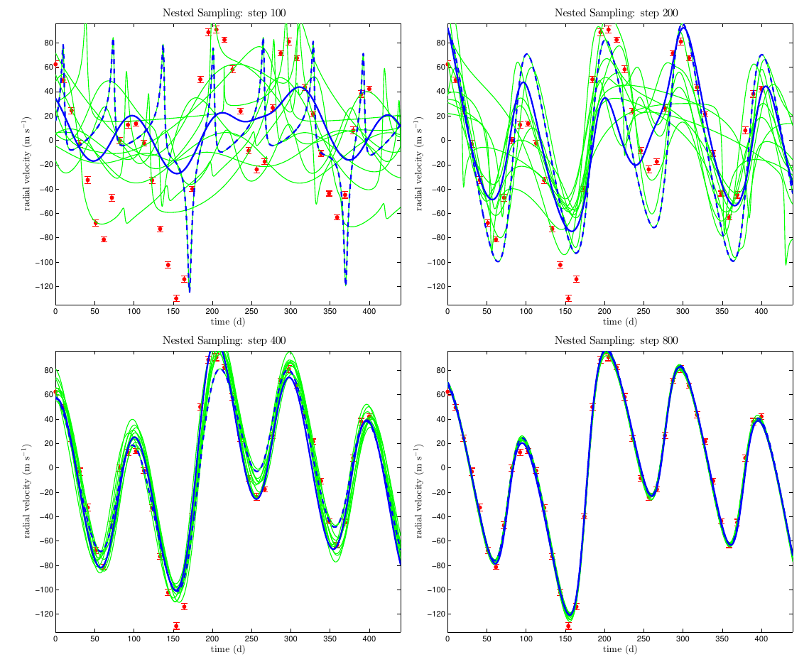

# Exoplanet-Detection-from-Bayesian-Inference

Harvard AM207 Final Project
Nested Bayesian model fitting and model selection for exoplanet radial velocity data

Read the Report [here](./AM207_GR_MARION_DIERICKX_XINYI_GUO_PHILIP_MOCZ_PROJECT.pdf)

Nested Sampling in progress

